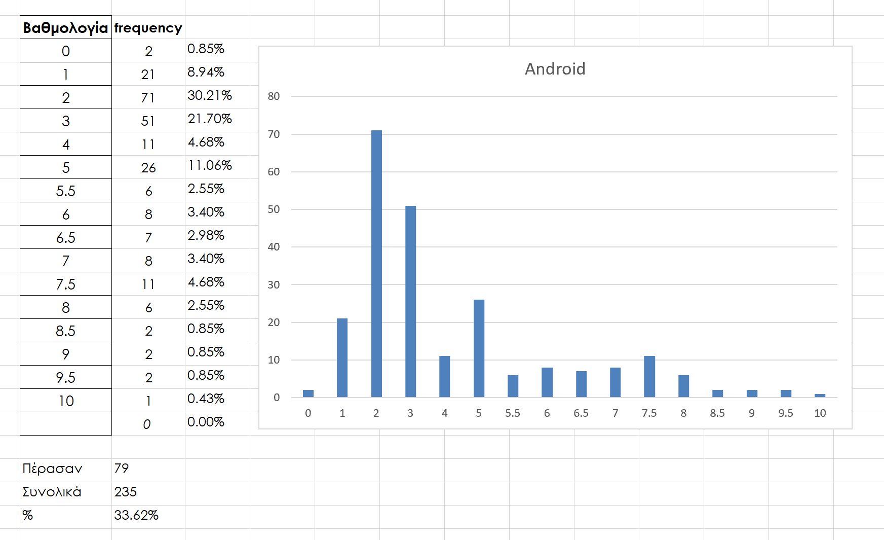
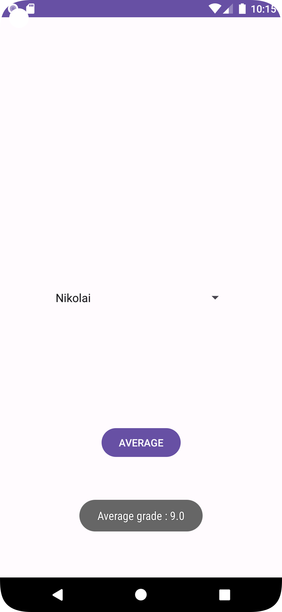

# ANDROID_JUNE24_UOM

Λύση του δεύτερου μέρους της εξέτασης ΑΝΑΠΤΥΞΗ ΕΦΑΡΜΟΓΩΝ ΓΙΑ ΚΙΝΗΤΕΣ ΣΥΣΚΕΥΕΣ (AIC601) (Android) Ιούνιος 2024 ΠαΜακ.

Η εξέταση διαχωρίστηκε σε δύο τμήματα: της πολλαπλής επιλογής μέσω eclass και της ανάπτυξης κώδικα (45λ). Στο δεύτερο τμήμα δόθηκε έτοιμο τμήμα κώδικα, με σχετικά σχόλια (οδηγίες), αλλά όχι το έτοιμο αρχείο `assets/students.xml`. **Βαθμολογία 4 και 6 αντίστοιχα.**




Η επιτυχία ήταν μόλις 33.62%, κάτι που δεν ήταν αρχικά αναμενόμενο, καθώς το δίκτυο δυσλειτουργούσε, με αποτέλεσμα να μην είναι δυνατή η εκτέλεση του κώδικα. Επιπλέον, ο χρόνος δεν ήταν επαρκής, λαμβάνοντας υπόψη και την ταχύτητα των Υ/Η.

## Σημεία προσοχής!

Πρέπει να γίνεται έλεγχος σε περίπτωση που δεν έχει περάσει κανένα μάθημα.

```java
private double calcAverageGrade(Student st) {
    int sum = 0, num = 0;
    for (int i : st.grades) {
        if (i >= 5) {
            sum += i;
            num++;
        }
    }
    // Calculate average
    // In case there is no grade, return 0
    return num == 0 ? 0 : (double) sum / num;
}
```

Εμφάνιση σχετικού μηνύματος βάσει του παραπάνω:

```java
public void onClickButton(View view) {
    String selectedName = sp.getSelectedItem().toString();
    String av = stdL.findAverage(selectedName);
    // Show toast for average grade
    if (av.equals("0.0")) {
        Toast.makeText(getApplicationContext(), "He didn't pass any lesson (AV=0)", Toast.LENGTH_LONG).show();
    } else {
        Toast.makeText(getApplicationContext(), "Average grade: " + av, Toast.LENGTH_LONG).show();
    }
}
```


Στον έτοιμο κώδικα έπρεπε να τροποποιηθεί ώστε να δέχεται ως όρισμα το `AssetManager`.

```java
public StudentList(AssetManager asset) {
    // Read from XML
    ArrayList<Student> stdTemp = new ArrayList<>();

    try {
        InputStream is = asset.open("students_resource.xml");

        DocumentBuilderFactory dbFactory = DocumentBuilderFactory.newInstance();
        DocumentBuilder dBuilder = dbFactory.newDocumentBuilder();
        Document doc = dBuilder.parse(is);
        Element element = doc.getDocumentElement();
        element.normalize();
        // For every tag student
        NodeList nList = doc.getElementsByTagName("student");

        for (int i = 0; i < nList.getLength(); i++) {
            Node n = nList.item(i);
            if (n.getNodeType() == Node.ELEMENT_NODE) {
                String name = ((Element) n).getElementsByTagName("name").item(0).getChildNodes().item(0).getNodeValue();
                String[] grades = ((Element) n).getElementsByTagName("grades").item(0).getChildNodes().item(0).getNodeValue().split(",");

                Student st = new Student(name);
                // Add every grade to student instance
                for (String grade : grades) {
                    st.addGrade(Integer.parseInt(grade.trim()));
                }
                // Add to temp array
                stdTemp.add(st);
            }
        }
        // Replace main array
        stdList = stdTemp;

    } catch (IOException | SAXException | ParserConfigurationException e) {
        e.printStackTrace();
    }
}
```

Πιθανό error κατά την εκτέλεση του Integer.parseInt λόγω του κενού ```   9,``` από το αρχείο xml. Απαιτούσε την χρήση trim()

```java
...
st.addGrade(Integer.parseInt(grade.trim()));
...
```


Απαιτούσε τη χρήση του `Spinner`, κάτι που δεν υπήρχε έτοιμο στη διδακτέα ύλη:

```java
...
ArrayAdapter<String> adapter = new ArrayAdapter<>(this, android.R.layout.simple_spinner_item, names);
adapter.setDropDownViewResource(android.R.layout.simple_spinner_dropdown_item);
sp.setAdapter(adapter);
...
```

Σωστή χρήση του `AssetManager`:

```java
protected void onCreate(Bundle savedInstanceState) {
    super.onCreate(savedInstanceState);
    setContentView(R.layout.activity_main);

    sp = findViewById(R.id.namesList);

    stdL = new StudentList(getAssets());

    ArrayList<String> names = stdL.getListNames();
    ...
}
```

### Δυσκολία στη δημιουργία του φακέλου `assets`:
Ο φάκελος πρέπει να έχει ακριβώς την ονομασία `assets` και να είναι τοποθετημένος μέσα στην _main_ από το Project View, δηλαδή `UOM_JUNE24/app/src/main/assets`. Η δημιουργία του μπορεί να γίνει μέσα από το Android Studio ή απευθείας από τον File Explorer των Windows. Η παρουσία του δεν είναι εμφανής στο Android Studio αν είναι άδειος. Με την προσθήκη ενός αρχείου, τότε αναγνωρίζεται και εμφανίζεται και στο Android View.

```xml
<?xml version="1.0" encoding="utf-8"?>
<students>
    <student>
        <name>Vasileios</name>
        <grades>9, 9, 9, 9, 9</grades>
    </student>
    ...
</students>
```

## Εικονική Αναπαράσταση της εφαρμογής



# Android Studio Version

**Recreated with:**

```
Android Studio Ladybug | 2024.1.3 Canary 3
Build #AI-241.18034.62.2413.12138059, built on July 25, 2024
Runtime version: 21.0.3+-12099254-b509.4 amd64
VM: OpenJDK 64-Bit Server VM by JetBrains s.r.o.
Linux 6.10.2-zen1-1-zen
GC: G1 Young Generation, G1 Concurrent GC, G1 Old Generation
Memory: 2048M
Cores: 8
Registry:
  ide.experimental.ui=true
Current Desktop: Hyprland
```

